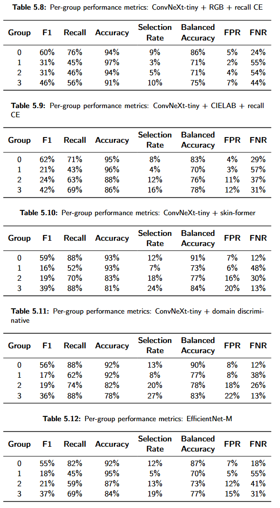

# 🔬 Melanoma Classification

A deep learning approach to skin cancer detection using ConvNeXt-Tiny.

## 📊 Model Repository

Our trained models and code are available on HuggingFace:  
[🤗 Melanoma Classification Models](https://huggingface.co/Mhara/melanoma_classification/tree/main)

## ✨ Results


*Figure: Performance metrics of our melanoma classification model on the ISIC 2020 dataset*

## 🛠️ Installation

Please follow our step-by-step setup guide in [INSTALL.md](INSTALL.md).

## 🧠 Training

For model training and fine-tuning instructions, see [TRAINING.md](TRAINING.md).

## 📦 Inference

Models are available on HuggingFace. You can load them using the `transformers` library:

```python
from transformers import AutoModelForImageClassification, AutoFeatureExtractor

model_name = "Mhara/melanoma_classification"
model = AutoModelForImageClassification.from_pretrained(model_name)
feature_extractor = AutoFeatureExtractor.from_pretrained(model_name)
```

## Downloading the weights
```bash
git lfs install

git clone https://huggingface.co/Mhara/melanoma_classification
```

or manually download the weights from the [HuggingFace model page](https://huggingface.co/Mhara/melanoma_classification/tree/main/weights).

Also, we have a google drive link for the weights: [Google Drive](https://drive.google.com/drive/folders/1n0T7q_B23edFUnzJSuIJGLcjuP-XZr-_?usp=sharing).